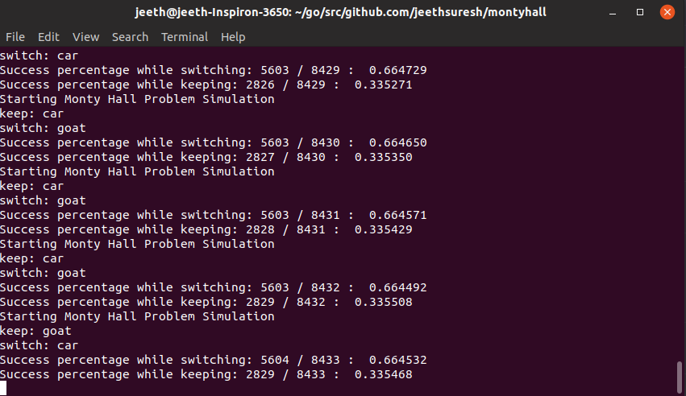

# MontyHall

I've always liked to point to the Monty Hall problem as a way to describe the inherent weirdness of the world, but until now I've never bothered to come with receipts.

### The Problem

Suppose you're on a game show, and the host (let's call him Monty Hall) presents you with three doors. Behind one is a brand new car, ready for you to drive off the lot. Behind the other two are goats who've already started to chew up the carpet.

> For the purposes of this discussion we're going to assume you want the car, and aren't looking to make goat stew as soon as the taping concludes

You choose one of the three doors (at random, because they're all identical), and then the problem gets interesting. The host will pick one of the two doors you didn't choose, revealing a goat. He then gives you a chance to switch your choice to the other unopened, unchosen door.

Is it in your best interests to switch?

### The Math

I'm stealing this right off of wikipedia: https://en.wikipedia.org/wiki/Monty_Hall_problem

It's absolutely in your best interests to switch, mathematically. At the start of the scenario, you have (obviously) a 33% chance to choose the car - if you choose to keep your original door this chance stays the same throughout the game. If you switch after the host opens another door, however, your chance to win actually DOUBLES, to 66%.

Here's a handy chart, lifted from wikipedia:

Suppose you pick door 1 in each of these three scenarios

|Behind door 1|Behind door 2|Behind door 3|Result if you switch|Result if you don't|
|Goat|Goat|Car|Win the Car|Win a Goat|
|Goat|Car|Goat|Win the Car|Win a Goat|
|Car|Goat|Goat|Win a Goat|Win the Car|

As you can see, switching to the unopened door gets you the car two out of three times, while staying only gets you the car if you originally chose it.

### The Simulation

To test this, I wrote a super short script (it's actually taken me more time to write this readme than the code itself) in Golang. I set up the initial state, including a starting choice and the position of the car. Then, I had the same simulation run against both paths of the problem: switching your door, or keeping it. The numbers match up pretty well - here's a shot of it in action

